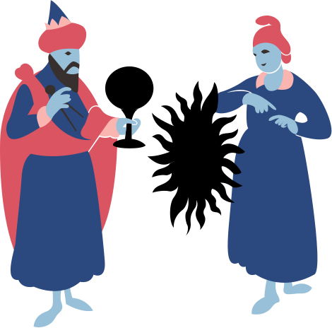

{.wizard-image}

Welcome to my study website for [_Structure and Interpretation of Computer Programs_][sicp], a.k.a. the Wizard Book. I started reading it in during my high school computer science class in 2012, and as of 2020 I'm still chipping away at it. Here, you will find:

- [Textbook notes](textbook.html) based on the [2.andresraba5 PDF][pdf],
- [Lecture notes](lecture.html) based on the [MIT OCW video lectures][lectures],
- [Favorite quotes](quote.html) from the textbook and lectures,
- [Exercise solutions](https://github.com/mk12/sicp) written in portable R6RS Scheme.

[sicp]: https://mitpress.mit.edu/sites/default/files/sicp/index.html
[pdf]: https://github.com/sarabander/sicp-pdf
[lectures]: https://ocw.mit.edu/courses/electrical-engineering-and-computer-science/6-001-structure-and-interpretation-of-computer-programs-spring-2005/video-lectures/
